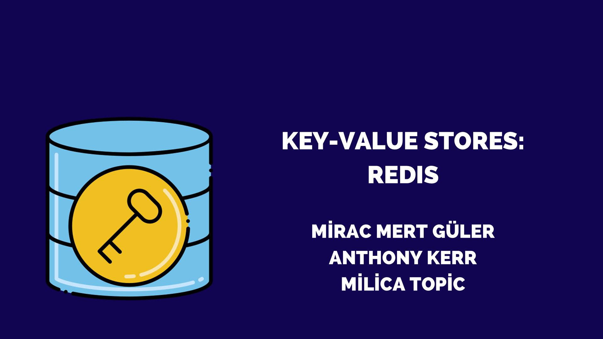
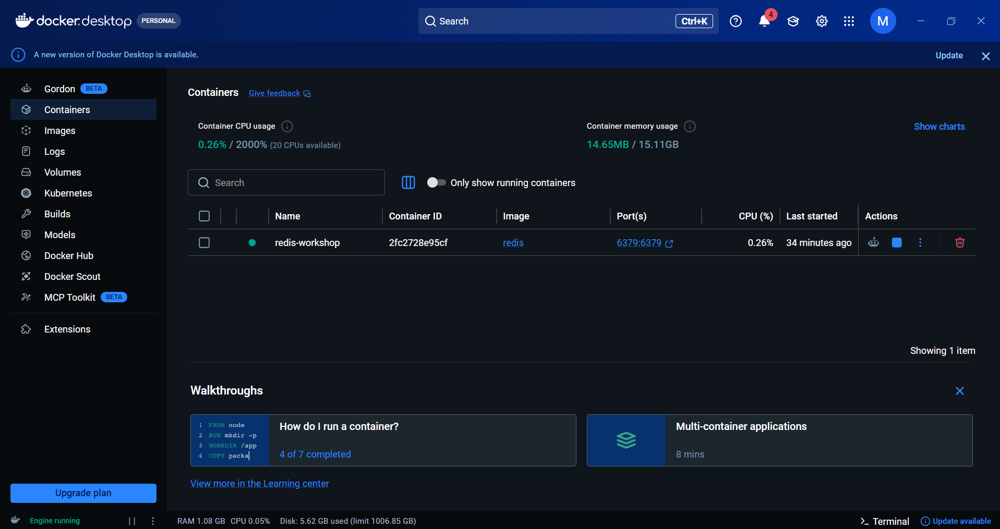

# Redis Workshop

> 📚 University workshop material prepared for the **Database Systems** course at **SRH Berlin University of Applied Sciences**.

A hands-on introduction to Redis, key-value databases, Docker, and Redis CLI through theoretical concepts and practical demonstrations.

---

## 📖 About

This repository contains the presentation and supporting materials prepared for a university workshop on Redis.

The workshop introduces the fundamentals of key-value databases, explains why Redis achieves high performance, explores its core data structures, and demonstrates practical use cases through hands-on examples.

---

## 📚 Topics Covered

- SQL vs NoSQL
- Key-Value Databases
- Redis Fundamentals
- Redis Architecture
- In-Memory Storage
- Persistence (RDB & AOF)
- Time Complexity (O(1) & O(log N))
- Redis Data Structures
- Real-world Use Cases
- Docker Setup
- Redis CLI
- Leaderboard Demonstration

---

## 🛠 Technologies

- Redis
- Docker
- Redis CLI

---

## 📂 Repository Structure

```text
redis-workshop
│
├── README.md
├── LICENSE
├── docker-compose.yml
├── redis-workshop.pdf
├── presentation/
│   └── cover.png
├── screenshots/
│   ├── docker-desktop.png
│   ├── redis-strings.png
│   ├── redis-lists.png
│   ├── redis-hashes.png
│   └── redis-leaderboard.png
├── examples/
│   ├── strings.md
│   ├── lists.md
│   ├── hashes.md
│   └── sorted-sets.md
```

---

## 📄 Presentation

The complete workshop presentation is included in this repository.

📥 **[Download the Workshop Presentation (PDF)](./redis-workshop.pdf)**

### Cover Preview



---

## 🚀 Quick Start

### Using Docker Compose

Run Redis locally:

```bash
docker compose up -d
```

This starts a Redis server on port **6379**.

Connect to Redis CLI:

```bash
docker exec -it redis-workshop redis-cli
```

Stop the container:

```bash
docker compose down
```

---

## 💻 Example Commands

### Strings

```redis
SET username "mirac"
GET username
DEL username
```

### Sorted Sets

```redis
ZADD leaderboard 100 Alice
ZADD leaderboard 250 Bob

ZRANGE leaderboard 0 -1 WITHSCORES
```

---

## 📚 Additional Examples

More Redis examples are available in the `examples` folder.

- [Strings](examples/strings.md)
- [Lists](examples/lists.md)
- [Hashes](examples/hashes.md)
- [Sorted Sets](examples/sorted-sets.md)

---

## 🖼 Demo Screenshots

### Docker Desktop

Redis running inside a Docker container.



---

### Redis Strings

Basic key-value operations using `SET`, `GET`, and `DEL`.


---

### Redis Lists

Working with ordered collections using `LPUSH` and `LRANGE`.


---

### Redis Hashes

Storing structured objects using `HSET` and `HGETALL`.


---

### Redis Sorted Sets — Leaderboard

Building a simple leaderboard using Redis Sorted Sets.


---

## 🤝 Credits

The workshop presentation was prepared collaboratively by:

- Mirac Mert Güler
- Anthony Kerr
- Milica Topic

The GitHub repository, documentation, Docker configuration, additional examples, screenshots, and repository organization were prepared and maintained by **Mirac Mert Güler**.

---

## 📜 License

This project is licensed under the [MIT License](LICENSE).
