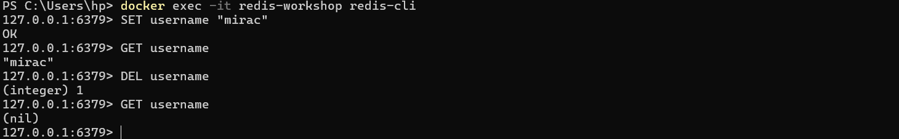
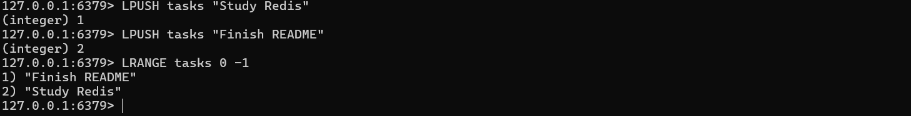
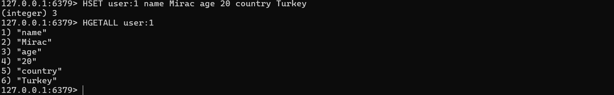
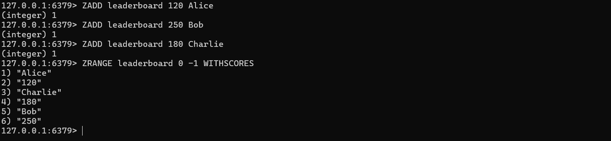

# Redis Workshop

> 📚 University workshop material prepared for the **Database Systems** course at **SRH Berlin University of Applied Sciences**.

A hands-on introduction to Redis, key-value databases, Docker, and RedisInsight through theoretical concepts and practical demonstrations.

---

## 📖 About

This repository contains the presentation and supporting materials prepared for a university workshop on Redis.

The workshop introduces the fundamentals of key-value databases, explains why Redis achieves extremely high performance, explores its core data structures, and demonstrates practical use cases through live examples.

---

## 📚 Topics Covered

- SQL vs NoSQL
- Key-Value Databases
- Redis Fundamentals
- Redis Architecture
- In-Memory Storage
- Persistence (RDB & AOF)
- Time Complexity (O(1) & O(log N))
- Redis Data Structures
- Real-world Use Cases
- Docker Setup
- RedisInsight
- Leaderboard Demonstration

---

## 🛠 Technologies

- Redis
- Docker
- RedisInsight

---

## 📄 Presentation

The complete workshop presentation is included in this repository.

**Presentation:** `Key-Value Stores Redis Overview (1).pdf`
---

## 🚀 Quick Start

Run Redis locally using Docker:

```bash
docker run -d --name redis-server -p 6379:6379 redis
```

Then connect using **Redis CLI** or **RedisInsight**.

---

## 💻 Example Commands

```redis
SET username "mirac"
GET username
DEL username
```

Sorted Set example:

```redis
ZADD leaderboard 100 Alice
ZADD leaderboard 250 Bob

ZRANGE leaderboard 0 -1 WITHSCORES
```

---
---

## 🖼 Demo Screenshots

### Redis Strings

Basic key-value operations using `SET`, `GET`, and `DEL`.



---

### Redis Lists

Working with ordered collections using `LPUSH` and `LRANGE`.



---

### Redis Hashes

Storing structured objects with `HSET` and `HGETALL`.



---

### Sorted Set Leaderboard

Building a simple leaderboard using Redis Sorted Sets.



## 🤝 Acknowledgements

Prepared as part of the **Database Systems** course at **SRH Berlin University of Applied Sciences**.
